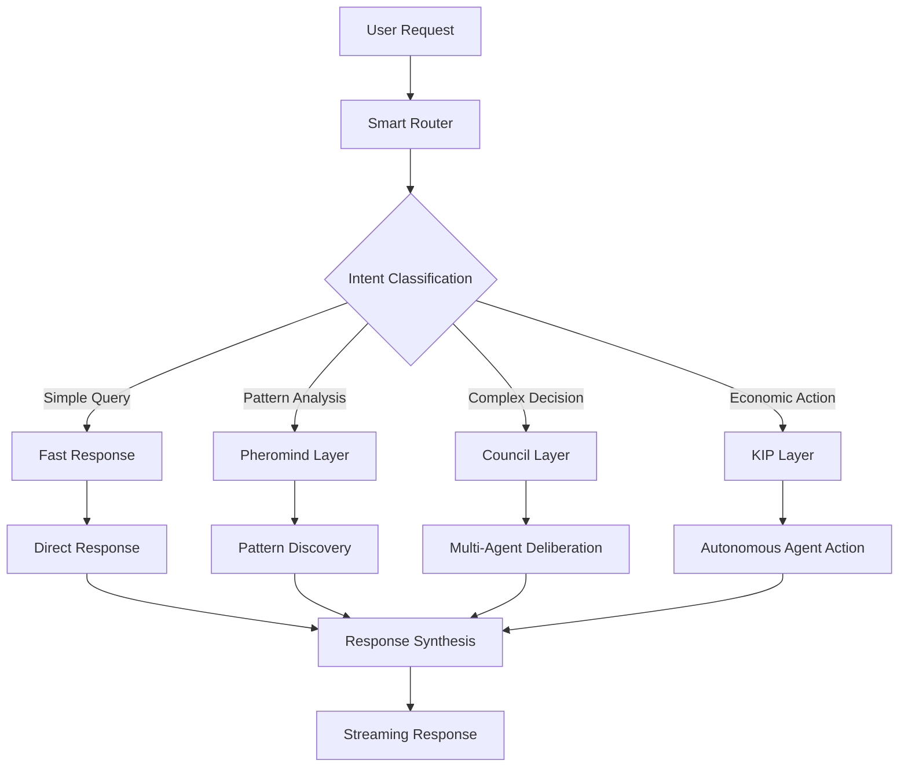
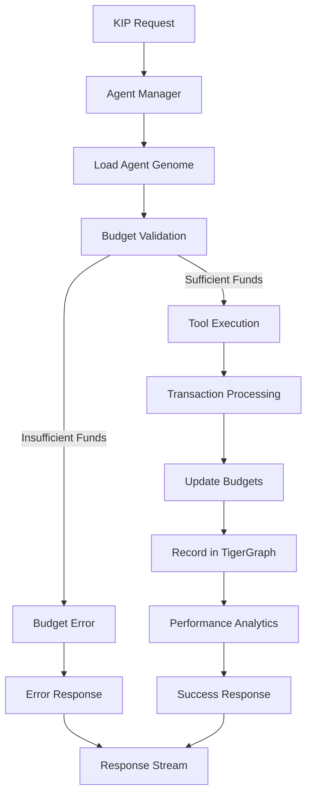
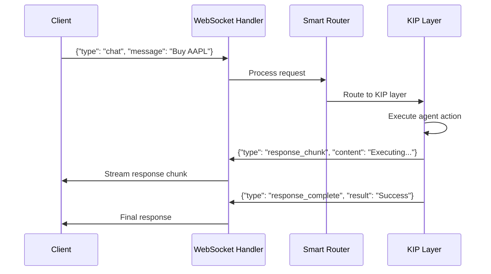
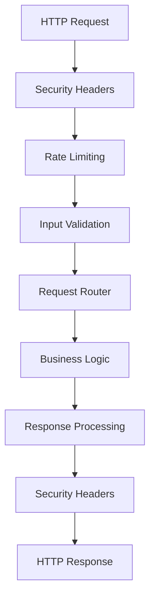
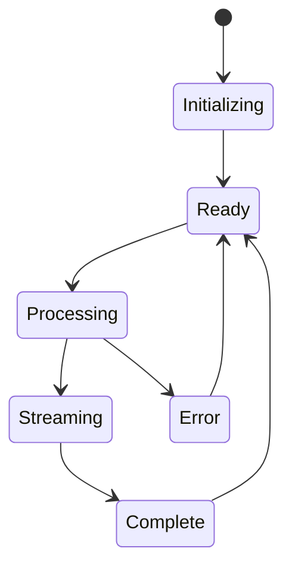

# 🔗 Integration Map - Component Interactions

> **Visual guide to how all system components work together**

## 🎯 **High-Level System Flow**

```
User Input → Smart Router → Cognitive Layer → Response
    ↓           ↓              ↓              ↓
WebSocket → Intent Classification → Action Execution → Streaming Response
    ↓           ↓              ↓              ↓
Audio/Text → Route Decision → Tool Usage → Audio/Text Output
```

---

## 🧠 **Smart Router Flow**

### **Request Processing Pipeline**



### **Intent Classification Logic**

| User Input | Classification | Target Layer | Example |
|------------|---------------|--------------|---------|
| "What's the weather?" | `fast_response` | Fast Response | Direct API call |
| "Analyze market trends" | `pheromind` | Pheromind | Pattern discovery |
| "Should I invest in X?" | `council` | Council | Multi-perspective analysis |
| "Buy 10 shares of AAPL" | `kip` | KIP | Economic agent action |

---

## 💰 **KIP Layer Integration**

### **Economic Engine Flow**



### **Agent-Tool-Transaction Relationships**

```
KIPAgent ----Uses----> Tool
    |                   |
    |                   |
Executes            Requires
    |                   |
    v                   v
Transaction ----Costs----> Budget
```

---

## 🗄️ **Data Storage Integration**

### **Redis (Speed Layer)**

**Purpose**: Real-time data, caching, session management

```
┌─────────────────┐    ┌─────────────────┐
│   Application   │───▶│     Redis       │
└─────────────────┘    └─────────────────┘
                              │
                              ▼
                       ┌─────────────────┐
                       │  Cache Keys:    │
                       │  - budget:*     │
                       │  - session:*    │
                       │  - pheromone:*  │
                       │  - rate_limit:* │
                       └─────────────────┘
```

### **TigerGraph (Knowledge Layer)**

**Purpose**: Persistent relationships, agent genomes, analytics

```
┌─────────────────┐    ┌─────────────────┐
│   Application   │───▶│   TigerGraph    │
└─────────────────┘    └─────────────────┘
                              │
                              ▼
                       ┌─────────────────┐
                       │  Graph Schema:  │
                       │  - KIPAgent     │
                       │  - Tool         │
                       │  - Transaction  │
                       │  - AgentBudget  │
                       └─────────────────┘
```

### **Data Sync Patterns**

1. **Write-Through**: Redis → TigerGraph for critical data
2. **Cache-Aside**: Check Redis first, fallback to TigerGraph
3. **Event-Driven**: Transaction events update both stores

---

## 🎤 **Voice Foundation Integration**

### **Real-Time Voice Pipeline**


### **Voice Processing Components**

| Component | Purpose | Technology |
|-----------|---------|------------|
| **STT Engine** | Speech→Text | NVIDIA Parakeet |
| **TTS Engine** | Text→Speech | Kyutai TTS |
| **Audio Processing** | Format conversion | FFmpeg |
| **WebSocket Handler** | Real-time streaming | FastAPI WebSockets |

---

## 🌐 **API & WebSocket Architecture**

### **HTTP API Endpoints**

```
┌─────────────────┐
│   FastAPI App   │
└─────────────────┘
         │
    ┌────┼────┐
    │    │    │
    ▼    ▼    ▼
┌─────┐ ┌─────┐ ┌─────┐
│Chat │ │Voice│ │Health│
│ API │ │ API │ │ API │
└─────┘ └─────┘ └─────┘
```

### **WebSocket Message Flow**



---

## 🛡️ **Security & Middleware Integration**

### **Request Processing Pipeline**



### **Security Layers**

1. **Network Level**: CORS, security headers
2. **Application Level**: Input validation, rate limiting
3. **Business Level**: Agent authorization, budget limits
4. **Data Level**: Redis/TigerGraph authentication

---

## 🤖 **LLM Integration Patterns**

### **Model Usage by Component**

| Component | Model | Purpose |
|-----------|-------|---------|
| **Smart Router** | Qwen3-14B | Intent classification |
| **Council Layer** | Qwen3-14B | Complex reasoning |
| **Code Generation** | DeepSeek-Coder | Programming tasks |
| **Fast Response** | Mistral-7B | Quick answers |
| **Agent Actions** | Qwen3-14B | Decision making |

### **LLM Call Pattern**

```python
# Standard pattern across all components
async def call_llm(prompt: str, model: str = "qwen2.5:14b"):
    async with get_ollama_client() as client:
        response = await client.chat(
            model=model,
            messages=[{"role": "user", "content": prompt}]
        )
        return response
```

---

## 🔄 **State Management Integration**

### **Orchestrator State Flow**



### **State Persistence**

- **Session State**: Redis (temporary)
- **Agent State**: TigerGraph (persistent)
- **Conversation Context**: Memory (current session)
- **Performance Metrics**: Both Redis + TigerGraph

---

## 🔧 **Development Integration**

### **Local Development Stack**

```
┌─────────────────────────────────────────┐
│              Local Machine              │
├─────────────────────────────────────────┤
│  FastAPI App (Port 8000)               │
│  ├─ Smart Router                       │
│  ├─ KIP Layer                          │
│  └─ Voice Foundation                   │
├─────────────────────────────────────────┤
│  Docker Services                       │
│  ├─ Redis (Port 6379)                 │
│  ├─ TigerGraph (Port 14240)           │
│  └─ Ollama (Port 11434)               │
└─────────────────────────────────────────┘
```

### **Testing Integration**

```python
# Test pattern - isolated component testing
@pytest.fixture
async def test_environment():
    # Setup test Redis/TigerGraph
    # Mock external dependencies
    # Provide clean test state
    yield test_env
    # Cleanup
```

---

## 📊 **Monitoring Integration**

### **Health Check Chain**

```
API Health → Service Health → Database Health → Model Health
     ↓             ↓              ↓              ↓
   FastAPI    →   Redis      →  TigerGraph  →   Ollama
             →   WebSocket   →   Schema     →   Models
```

### **Metrics Collection**

1. **Application Metrics**: Request latency, error rates
2. **Business Metrics**: Agent performance, financial data
3. **Infrastructure Metrics**: CPU, memory, disk usage
4. **LLM Metrics**: Token usage, response times

---

## 🚨 **Error Handling Integration**

### **Error Propagation Chain**

```
Component Error → Error Boundary → Circuit Breaker → Graceful Degradation
```

### **Recovery Patterns**

| Error Type | Recovery Strategy | Example |
|------------|------------------|---------|
| **Redis Failure** | Cache miss handling | Continue without cache |
| **TigerGraph Failure** | Agent genome fallback | Use cached agent data |
| **LLM Failure** | Model switching | Fallback to simpler model |
| **Budget Exceeded** | Emergency freeze | Stop all spending |

---

## 🎯 **Key Integration Points**

### **Critical Dependencies**

1. **Smart Router ← → Cognitive Layers**: Intent routing
2. **KIP Layer ← → TigerGraph**: Agent genome persistence  
3. **Voice Foundation ← → WebSockets**: Real-time streaming
4. **All Components ← → Redis**: Caching and session state
5. **All Components ← → Ollama**: LLM processing

### **Data Flow Bottlenecks**

- **TigerGraph Schema Queries**: Complex relationship traversals
- **LLM Processing**: Model inference latency
- **WebSocket Streaming**: Real-time message delivery
- **Budget Validation**: Redis/TigerGraph sync delays

### **Scaling Considerations**

- **Horizontal**: Multiple FastAPI instances (stateless)
- **Vertical**: Larger models, more memory for TigerGraph
- **Caching**: Redis cluster for session management
- **Database**: TigerGraph clustering for high availability